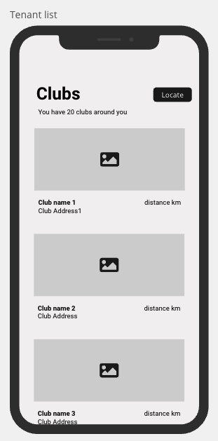

# technical-test-mobile
Mobile project for Playtomic interviewees: iOS and Android

## Project overview
This example project offers a simplified subset of the real Playtomic application in both platforms (iOS and Android), intended for a quick setup in the technical interview process. It bypasses the complexities of the full project.

## Project structure
While the full Playtomic project is a multi-module build across several layers, this sample is streamlined into a single module, divided into the following key directories:

- **Foundation**: Utilities supporting the broader codebase, especially relevant are the asynchronous and observability primitives: `Promise` and `Observable`.
- **Anemone SDK**: Services and models for backend connectivity, networking utilities, and JSON deserialization. The only relevant part is the `TenantService` and `Tenant` model.
- **Playtomic UI**: UI components. To simplify, all standard Playtomic components, validators, behaviors, and styles are excluded from this example. No relevant parts for the purpose of the test are included here.
- **Mozart**: Core platform abstractions and architectural definitions for MVI. Relevant parts are the `LocationManager` and the MVI parts (`MVIPresenter`, `MVITypes` and `MVIMiddleware`)
- **App**: Minimal application code. The relevant parts are the manual dependency management in `DependencyProvider` and the `Tenant` module, which will be modified during the task.


## Installation instructions

The Android and iOS projects are self-contained, requiring no special tools beyond the standard dependency declarations in Gradle/SPM. Simply ensure you have the latest versions of Android Studio and Xcode to proceed.

## Task details

The assignment involves implementing a list of clubs (`Tenant`) in your preferred platform (iOS or Android). It should look something like this:




The app should use the `ILocationManager` to fetch user's location, and then fetch backend data using the `ITenantService`. The UI can be simple, but should include all the clubs retrieved from the backend with some basic info about (title, picture, address and distance), and as a nice to have some basic loading state and empty/error state.

**Key areas to cover**:

- **Models**: Define `TenantListViewState`, `TenantListViewAction`, and `TenantListActionResult` with appropriate structures.
- **Presentation layer**: Implement `TenantListPresenter` following MVI architecture
- **View Layer**: Create the `TenantListView` UI, preferably with SwiftUI/Compose. UIKit/Android Views are acceptable based on candidate experience.
- **Test Layer**: Discuss and create basic test cases for this feature.


## Tips using the code

- You can fetch user location by using:

```
locationManager.findLocation(permissionRequest: LocationPermissionRequest.always, minAccuracy: 5000.0)
    .then { location in
        // Success handling
    }
    .catchError { error in
         // Error handling
	} 
```
Remember to set your simulator location in Madrid (`40.4`, `-3.7`) to get results

- You can search for clubs using:

```
tenantService.search(coordinate: coordinate, radius: 50000, sportId: nil, pagination: nil)
	.then { tenants in
        // Success handling
    }
    .catchError { error in
         // Error handling
	} 
```

- You can cascade promises using:

```
promise1
	.then(promise: { promise2 })
	....
```

## Other resources
- [MVI at Playtomic](https://dev.to/playtomic/mvi-at-playtomic-2pea): A blog post detailing our approach to MVI.
- [Playtomic's shared architecture](https://dev.to/playtomic/playtomics-shared-architecture-using-swift-and-kotlin-320b): An older but relevant blog post on our code sharing strategy